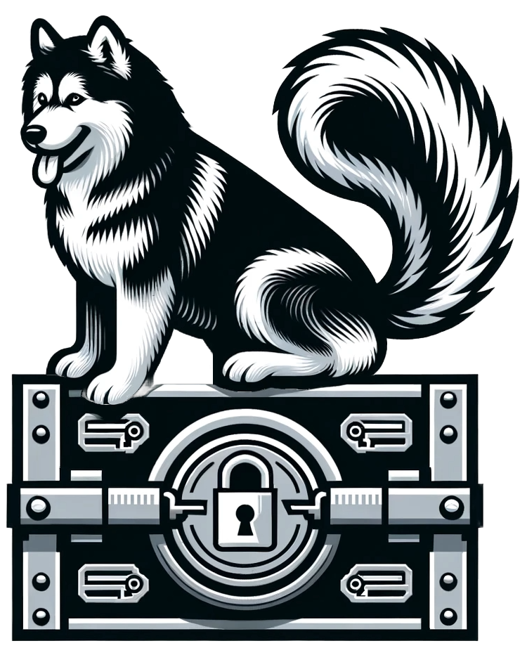

# Armory: Skunkwolf Certificate & Key Management

Armory is a Docker-based utility designed to facilitate the management of certificates and keys, including the generation of root Certificate Authority (CA) certificates and service certificates signed by a root CA. This first version generates and stores the keys within the file system of the host machine. Future versions will provide more robust key management capabilities. 

## Table of Contents
- [Getting Started](#getting-started)
- [Generating Certificates](#generating-certificates)
- [Access Certificates on Local Machine](#access-certificates-on-local-machine)
- [Cleanup](#cleanup)
- [Ensuring the Certificates are Trusted](#ensuring-the-certificates-are-trusted)
- [Contributing](#contributing)
- [License](#license)

## Getting Started

These instructions will get you a copy of the project up and running on your local machine for development and testing purposes.

### Prerequisites
- Docker installed on your local machine.
- Basic knowledge of Docker and command-line operations.

### Clone the Repository
```bash
$ git clone https://github.com/skunkwolf/armory.git
$ cd <repository-directory>
```

### Build Docker Image

Build the Docker image using the following command:

```bash
docker build -t skunkwolf-ca .
```

### Run Docker Container

Run a Docker container from the image, mounting a volume from your local machine to the container. This volume will be used to store and access the generated certificates on your local machine.

```bash
docker run -it --name skunkwolf-ca -v $(pwd)/ca:/root/ca skunkwolf-ca sh
```

[Back to Top](#table-of-contents)

## Generating Certificates

Once initial setup is complete a script can be used to generate the keys, certificate signing requests (CSRs), and certificates that the services need to use to establish TLS. In order to sign the CSR and create a certificate a root certificate is needed. For the purposes of development and testing the signing certificate, the Root CA will be created locally. Instructions on how to add this root certificate to the trusted store are provided here: [Ensuring the Certificates are Trusted](#ensuring-the-certificates-are-trusted)

### Root CA Certificate

If a Root CA Certificate doesn't already exist, execute the following commands inside the container to generate the root CA certificate and key. This process onlly needs to be completed once and the same root certificate can be used to sign all of the service certificates generated by the script.

When creating the key you will be promoted to provide a PEM Passphrase. This should be treated with the upmost security as with it additional keys can be created and signed. You will also use this to sign the skunkwolf-ca.crt

```bash

# Step 1: export the working directory
export WORKDIR="/root/ca"

# Step 2: Generate the private key for the root CA
openssl genpkey -algorithm RSA -out $WORKDIR/skunkwolf-ca.key -aes256 -pkeyopt rsa_keygen_bits:4096

# Alternatively absolute paths can be used if $WORKDIR hasn't been exported
openssl genpkey -algorithm RSA -out /root/ca/skunkwolf-ca.key -aes256 -pkeyopt rsa_keygen_bits:4096

# Step 3: Generate the root CA certificate
openssl req -key $WORKDIR/skunkwolf-ca.key -new -x509 -days 3650 -out $WORKDIR/skunkwolf-ca.crt -subj "/CN=Skunkwolf CA/O=Skunkwolf /C=US" -extensions v3_ca -config /etc/ssl/openssl.cnf -sha256

# Alternatively absolute paths can be used if $WORKDIR hasn't been exported

openssl req -key /root/ca/skunkwolf-ca.key -new -x509 -days 3650 -out /root/ca/ca.crt -subj "/CN=Skunkwolf CA/O=Skunkwolf /C=US" -extensions v3_ca -config /etc/ssl/openssl.cnf -sha256
```
You should now have the `skunkwolf-ca.key` and `skunkwolf-ca.crt` available in the working directory. 

[Back to Top](#table-of-contents)


### Service Certificates

This script can be run inside the container to generate service certificates signed by the root CA previously generated. It automates the process of generating service certificates and it ensures that the necessary root CA certificate and key exist before proceeding with the generation of service-specific certificates.

You are prompted to provide several parameters, two of these, the common name and organizational unit follow naming conventions, for example, if you are generating a certificate for a web service running at api.example.com and managed by your operations team, you might choose:
- Common Name: `api.example.com`
- Organizational `Unit: Operations`
- Subject Alternative Name `DNS:your-service.example.com, DNS:*.your-service.example.com`

In the case of a NATS cluster deployed through helm, things are a little different. The SAN field in a TLS certificate allows the certificate to be valid for multiple domain names, and in this context, it's being used to ensure the TLS certificates are valid for the domain names used by clients and cluster nodes when connecting. The values that should be used are specifed below. 

#### Usage:

```bash
generate-nats-certs.sh -c "nats-cluster" -o nats-cluster -u "skunkwolf" -s "DNS:nats-headless.default.svc.cluster.local, DNS:*.nats-headless.default.svc.cluster.local"

```

#### Parameters:

- `-c`: Common Name (CN) for the service certificate.
- `-o`: Base name for the output files. The script will generate `${OUTPUT_NAME}.key`, `${OUTPUT_NAME}.csr`, and `${OUTPUT_NAME}.crt`.
- `-u`: Organizational Unit (OU) for the service certificate.
- `-s`: Subject Alternative Name (SAN) for the certificate. 

#### Default Values:

If parameters are not provided, the script uses the following default values:

- Common Name: "nats-cluster"
- Output Name: "nats-cluster"
- Subject Alternative Name: "DNS:nats-headless.default.svc.cluster.local, DNS:*.nats-headless.default.svc.cluster.local"
- Organizational Unit: "skunkwolf"

#### Steps Performed by the Script:

1. **Working Directory Setup**: Sets the working directory to `/root/ca` where the root CA certificate and key are expected to be located.

2. **Root CA Verification**: Checks for the existence of the root CA certificate and key. If either is missing, the script exits.

3. **Parameter Parsing**: Parses command-line arguments for the Common Name, Output Name, and Organizational Unit.

4. **Private Key Generation**: Generates a private key for the service using the RSA algorithm.

5. **Certificate Signing Request (CSR) Creation**: Creates a Certificate Signing Request using the provided or default Common Name and Organizational Unit.

6. **Certificate Signing**: Signs the CSR with the root CA certificate and key, generating a service certificate valid for 365 days.

7. **(Optional) Certificate Printing**: Uncomment the last line of the script if you wish to print the generated service certificate to the console.

#### Output:

The script generates three files for each service:

- Private Key: `${OUTPUT_NAME}.key`
- Certificate Signing Request: `${OUTPUT_NAME}.csr`
- Service Certificate: `${OUTPUT_NAME}.crt`

These files are stored in the working directory `/root/ca` and can be accessed on your local machine via the mounted volume when running the Docker container.

to inspect the service certificates you can use this command: 

```bash
openssl x509 -in /root/ca/certificate.crt -text -noout
```

---

[Back to Top](#table-of-contents)


## Access Certificates on Local Machine

Exit the Docker container, and you'll find the generated certificates in the `${pwd}/ca` directory on your local machine.

[Back to Top](#table-of-contents)

## Cleanup

You can stop and remove the container once you've generated the necessary certificates:

```bash
docker stop skunkwolf-ca && docker rm skunkwolf-ca
```

[Back to Top](#table-of-contents)

## Ensuring the Certificates are Trusted 
To ensure that the service certificates are trusted, you'll need to add the root certificate to the trusted certificate store on each machine that will be interacting with the service. The process varies slightly depending on the operating system. Here's how you could do it on a few common systems:

### 1. **Linux**:

On many Linux systems, the trusted certificates are stored in a directory such as `/usr/local/share/ca-certificates/`. You can add a new trusted root certificate by:

1. Copying the root certificate file to this directory.
```bash
sudo cp /path/to/your/root.crt /usr/local/share/ca-certificates/root.crt
```

2. Updating the certificate trust store.
```bash
sudo update-ca-certificates
```

### 2. **Windows**:

On Windows, you would typically use the Microsoft Management Console (MMC) to add a trusted root certificate:

1. Press `Win + R`, type `mmc`, and press `Enter`.
2. Go to `File` > `Add/Remove Snap-in`, select `Certificates`, click `Add`, select `Computer account`, and click `Next` > `Finish` > `OK`.
3. Expand `Certificates (Local Computer)`, right-click on `Trusted Root Certification Authorities` > `All Tasks` > `Import`.
4. Follow the wizard to import the root certificate.

### 3. **macOS**:

On macOS, you can use the Keychain Access utility to add a trusted root certificate:

1. Open `Keychain Access`.
2. Drag the root certificate file into the `Keychain Access` window.
3. Right-click on the imported certificate, select `Get Info`, expand the `Trust` section, and set `When using this certificate` to `Always Trust`.

### 4. **Programmatically**:

In some scenarios, you might be interacting with services in a programming environment. In such cases, you might need to specify the root certificate programmatically. For example, in Go, you might create a custom `http.Client` with a custom `tls.Config` that includes the root certificate.

```go
import (
	"crypto/tls"
	"crypto/x509"
	"io/ioutil"
	"net/http"
)

func main() {
	caCert, err := ioutil.ReadFile("/path/to/your/root.crt")
	if err != nil {
		log.Fatal(err)
	}
	caCertPool := x509.NewCertPool()
	caCertPool.AppendCertsFromPEM(caCert)

	client := &http.Client{
		Transport: &http.Transport{
			TLSClientConfig: &tls.Config{
				RootCAs: caCertPool,
			},
		},
	}

	// ...
}
```

[Back to Top](#table-of-contents)

## Contributing

If you wish to contribute to this project, please feel free to fork the repo, create a new branch, commit your changes, and open a pull request.

[Back to Top](#table-of-contents)

## License

This project is licensed under the MIT License - see the LICENSE.md file for details.

[Back to Top](#table-of-contents)